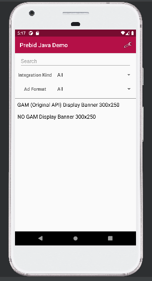
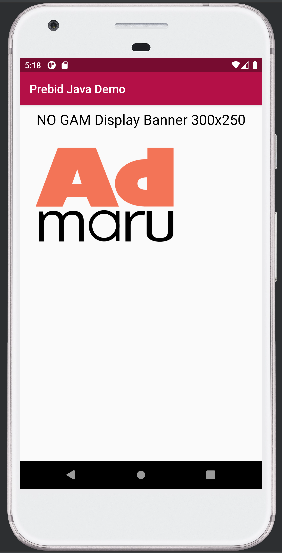
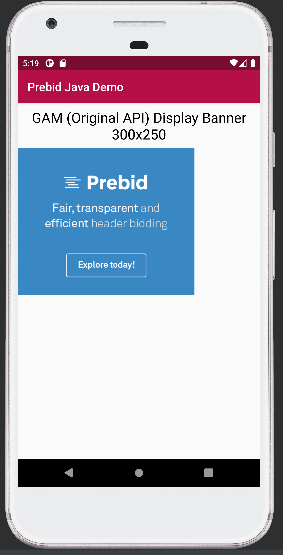

# Prebid Mobile using Admaru Prebid Server example

This repository contains an example of Admaru Prebid Server usage. The example is in `PrebidDemoJava`.

The project contains 2 activities:

* an example running without GAM, using stored request with id 1 and receiving bid from Admaru SSP mock
* an example running with GAM, using stored request with id 1 and receiving bid from Appnexus (it doesn't work with Admaru, probably because of missing SSL certificate on Admaru Prebid Server Cache)

## Screenshots

- application menu

- example without using GAM (request to Admaru Prebid Server and from Prebid Server to Admaru SSP mock)

- example using GAM (request to Admaru Prebid Server and from Prebid Server to Appnexus)

